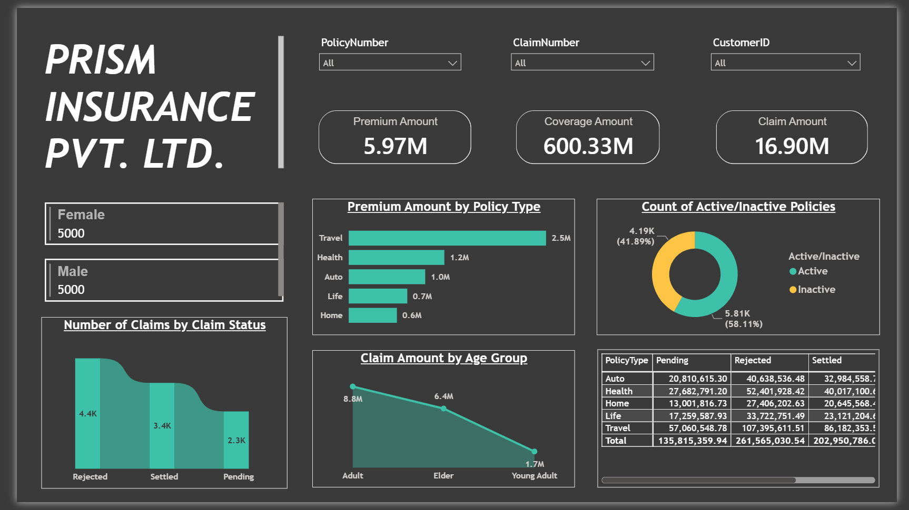
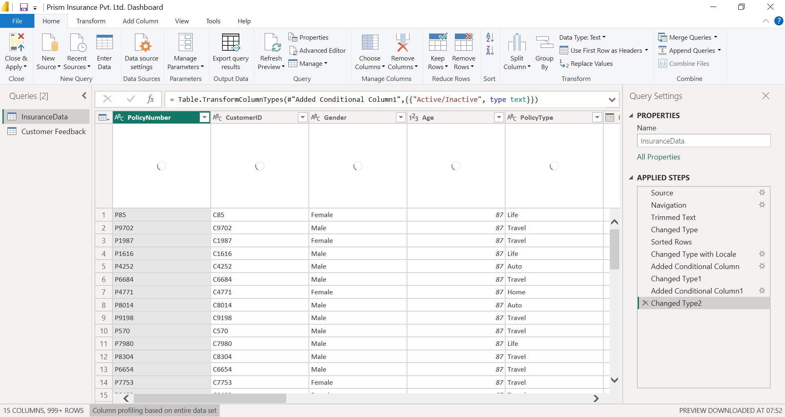
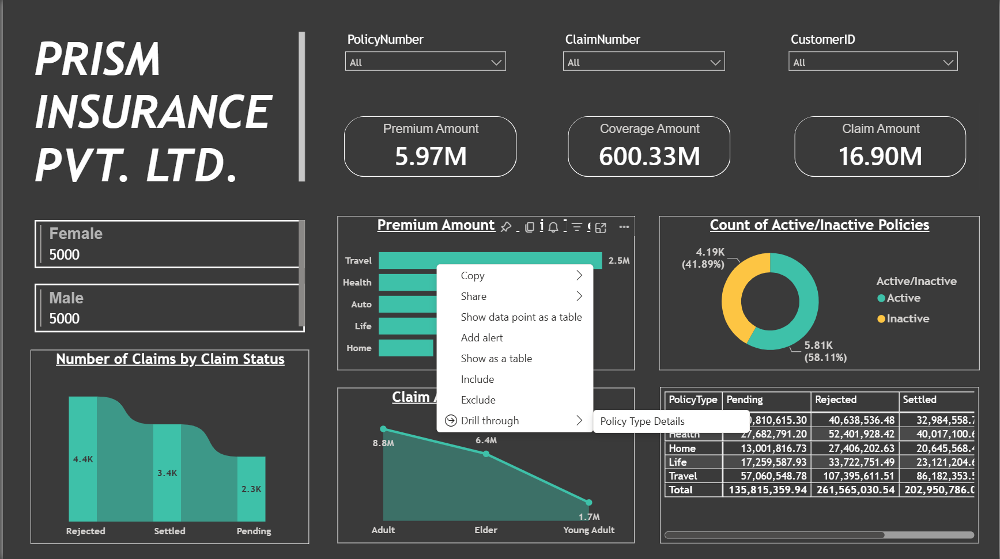
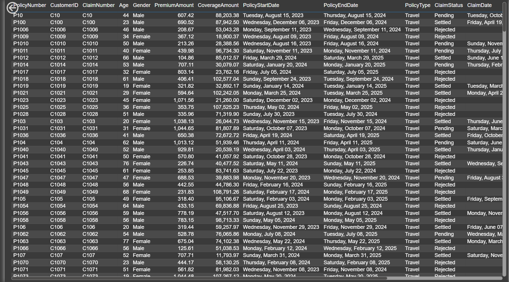
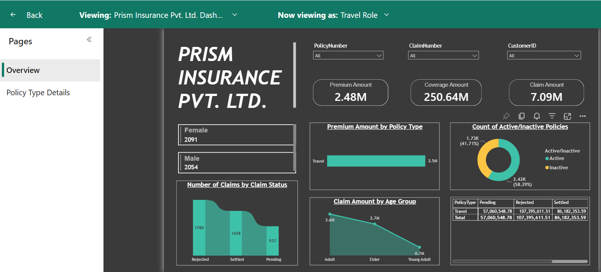
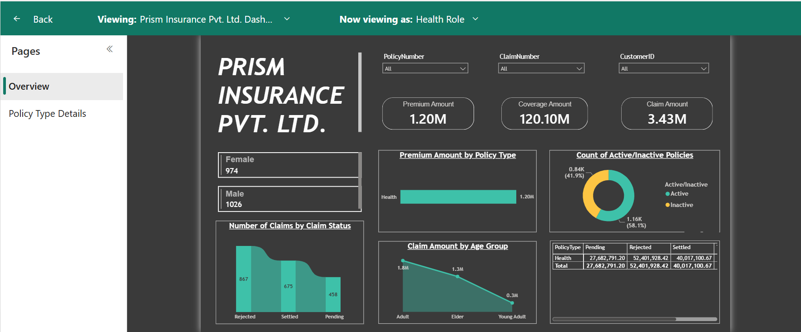
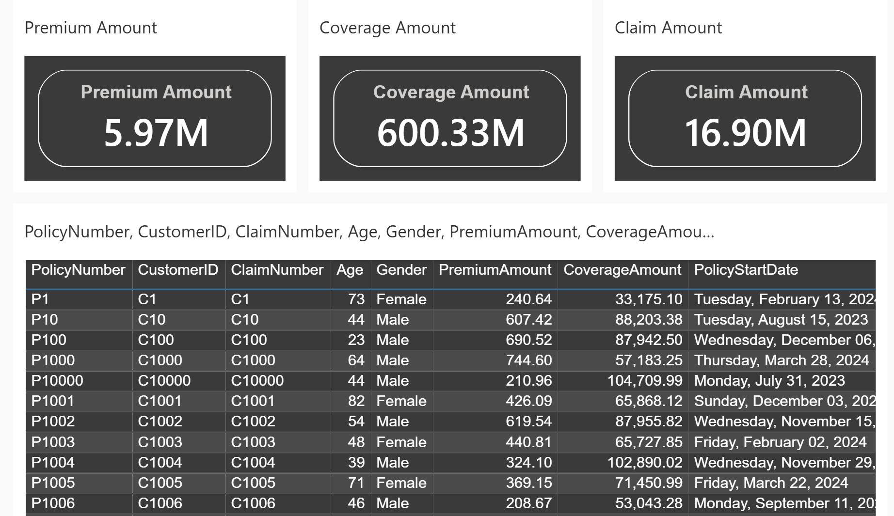

# Prism Insurance Analytics Dashboard (Power BI)


## 📌 Project Overview

This project demonstrates an end-to-end Insurance Analytics solution built using
**Microsoft SQL Server**, **Power BI Desktop**, **Power Query**, and **Power BI Service**.

The dashboard provides insights into insurance policies, premiums, coverage amounts, and claims while implementing **Row-Level Security (RLS)** to ensure secure data access for different business users.

---

## 📋 Business Requirements

The management team at **Prism Insurance Pvt. Ltd.** requires an interactive Power BI dashboard to monitor insurance operations, analyze claims performance, track policy activity, and support data-driven decision-making. The dashboard should provide the following business insights and capabilities:

### Key Performance Indicators (KPIs)

The dashboard must provide high-level visibility into the company's overall insurance portfolio through the following KPIs:

- Total Premium Amount
- Total Coverage Amount
- Total Claim Amount

### Claims Analysis

The business needs to monitor claims activity and understand claim patterns across the organization.

Requirements:

- Analyze the Number of Claims by Claim Status
- Analyze Claim Amounts across different customer Age Groups
- Identify claim trends among:
  - Young Adult (≤ 24)
  - Adult (25–60)
  - Elder (> 60)

### Policy Analysis

The business requires visibility into policy performance and policy activity.

Requirements:

- Analyze Total Premium Amount by Policy Type
- Analyze Total Coverage Amount by Policy Type and Claim Status
- Track Active and Inactive Policies

#### Policy Status Business Logic

Policy status should be derived using the Policy End Date:

| Condition | Policy Status |
|------------|--------------|
| PolicyEndDate ≤ 10-Dec-2024 | Inactive |
| PolicyEndDate > 10-Dec-2024 | Active |

This classification helps management identify expired policies and monitor currently active policies.

### Customer Analysis

The business wants to understand customer demographics and segmentation.

Requirements:

- Analyze customer distribution by Gender
- Segment customers into Age Groups:
  - Young Adult (≤ 24)
  - Adult (25–60)
  - Elder (> 60)

### Dashboard Interactivity

The dashboard should allow users to dynamically filter and explore data.

Requirements:

- Filter data using:
  - Policy Number
  - Claim Number
  - Customer ID
- Provide drill-through functionality to navigate from summary-level insights to detailed policy-level records

### Detailed Policy Investigation

Business users should be able to investigate individual policy records directly from dashboard visuals.

Requirements:

- Create a dedicated Drill Through page
- Allow users to right-click a selected Policy Type
- Display detailed policy-level information for the selected Policy Type

### Security Requirements

Different business users should only be able to access data relevant to their responsibilities.

Requirements:

- Implement Row-Level Security (RLS)
- Create a Travel Policy role
- Create a Health Policy role

Role Access Rules:

| Role | Access |
|--------|---------|
| Travel Role | Travel Policies Only |
| Health Role | Health Policies Only |

---

## 🛠️ Tools & Technologies

| Tool | Purpose |
|--------|---------|
| Microsoft SQL Server | Data Storage & Management |
| SQL | Data Import & Querying |
| Power BI Desktop | Data Visualization |
| Power Query Editor | Data Cleaning & Transformation |
| Power BI Service | Report Publishing |
| Row-Level Security (RLS) | Data Access Control |

---

## 📂 Dataset Information

- Source: CSV File
- Total Records: 10,000
- Imported into Microsoft SQL Server
- Connected to Power BI using **Import Mode**

---

## 🔄 Data Preparation & Transformation

### SQL Server

- Imported insurance dataset from CSV into SQL Server.
- Established SQL Server as the primary data source for reporting.

### Power Query Transformations

Performed data cleaning and profiling using Power Query Editor:

- Removed leading/trailing spaces using Trim
- Corrected data types
- Created Age Group categories using Conditional Column
- Created Policy Status column (Active/Inactive)

### Age Group Logic

| Age | Category |
|-------|----------|
| ≤ 24 | Young Adult |
| 25 - 60 | Adult |
| > 60 | Elder |

### Policy Status Logic

| Condition | Status |
|------------|---------|
| PolicyEndDate ≤ 10-Dec-2024 | Inactive |
| PolicyEndDate > 10-Dec-2024 | Active |

---

## 📊 Dashboard Features

### Filters / Slicers

- Policy Number
- Claim Number
- Customer ID

### KPI Cards

- Total Premium Amount
- Total Coverage Amount
- Total Claim Amount

### Multi Row Card

- Gender Distribution

### Ribbon Chart

- Number of Claims by Claim Status

### Bar Chart

- Total Premium Amount by Policy Type

### Line Chart

- Claim Amount by Age Group

### Donut Chart

- Active vs Inactive Policies

### Matrix Visual

- Total Coverage Amount by Policy Type and Claim Status

---

## 🔍 Drill Through Analysis

A dedicated Drill Through page was created to enable detailed policy-level analysis.

### Functionality

Users can:

1. Right-click on a Policy Type
2. Select Drill Through
3. Navigate to Policy Type Details Page
4. View detailed policy information for the selected category

This feature allows seamless transition from summary insights to granular records.

---

## 🔐 Row-Level Security (RLS)

Implemented Row-Level Security to restrict data visibility based on user roles.

### Roles Created

- Travel Role
- Health Role
  
### Validation

RLS was tested in:

- Power BI Desktop
- Power BI Service

---

## 📷 Project Screenshots

### Dashboard Overview

The main dashboard provides a high-level view of insurance performance through KPIs, slicers, and interactive visualizations for claims, premiums, coverage amounts, policy status, and customer demographics.



---

### Power Query Data Transformation

Data cleaning and transformation were performed in Power Query Editor, including data profiling, trimming unwanted spaces, changing data types, creating Age Group categories, and deriving Active/Inactive policy status.



---

### Drill Through - Source Page

Users can right-click on a Policy Type from the overview dashboard and navigate to a detailed analysis page using Power BI Drill Through functionality.



---

### Drill Through - Destination Page

The destination page displays detailed policy-level records for the selected Policy Type, enabling deeper analysis and investigation.



---

### Travel Policy RLS Configuration

Row-Level Security (RLS) implementation for the Travel role, ensuring users can only access Travel Policy records.



---

### Health Policy RLS Configuration

Row-Level Security (RLS) implementation for the Health role, restricting users to Health Policy records only.



---

### Power BI Service Deployment

The dashboard was published to Power BI Service.



---

## 🎥 Dashboard Walkthrough

The project includes:

- End-to-end SQL Server to Power BI integration
- Data transformation using Power Query
- Interactive dashboard visualizations
- Drill Through navigation
- Row-Level Security (RLS)
- Power BI Service deployment and testing

---

## 📈 Project Outcome

Successfully developed and deployed an end-to-end Insurance Analytics solution using SQL Server, Power BI Desktop, Power Query, and Power BI Service. The dashboard enables stakeholders to monitor premium, coverage, and claim performance, analyze customer demographics, track active and inactive policies, and investigate policy-level details through drill-through functionality. Row-Level Security (RLS) was implemented to ensure secure and role-based access to policy data.

---

## 📁 Repository Structure

```text
Insurance-Analytics-PowerBI-Dashboard/
│
├── README.md
│
├── SQL/
│   └── PrismInsurance.sql
│
├── dataset/
│   ├── InsuranceData.csv
│   └── Insurance+Customer+Feedback.xlsx
│
├── PowerBI/
│   ├── Prism Insurance Pvt. Ltd. Dashboard.pbip
│   ├── Prism Insurance Pvt. Ltd. Dashboard.Report/
│   └── Prism Insurance Pvt. Ltd. Dashboard.SemanticModel/
│
└── screenshots/
    ├── overview.png
    ├── PowerQueryEditor.png
    ├── DrillThrough_SourcePage.png
    ├── DrillThrough_DestinationPage.png
    ├── TravelRole_RLS.png
    ├── HealthRole_RLS.PNG
    └── PowerBI_Service_Dashboard.png
```

---

## 👩‍💻 Author

**Paridhi Singhal**

Aspiring Data Analyst | SQL | Power BI | Data Visualization

### Connect with Me

- [LinkedIn Profile](https://www.linkedin.com/in/paridhi-singhal123/)


---


